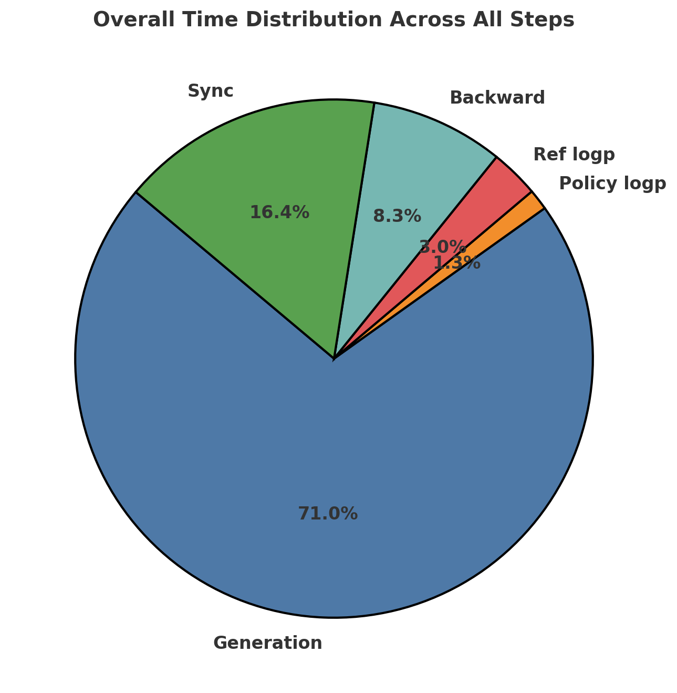

### Why Minimal-R1?

I aimed to reproduce the original [R1 paper](https://github.com/deepseek-ai/DeepSeek-R1) using only an **8x H100 server**. However, during development, I encountered some limitations with open-r1 (though these may have been resolved now):

- **Token Generation Limit**: Open-r1 could not generate more than **256 completion tokens**, even with a 7B model. Since long-CoT (Chain-of-Thought) reasoning is a key novelty of R1, **long-form generation is essential**.
- **DeepSpeed ZeRO-3 Incompatibility**: Open-r1 did not work with **DeepSpeed ZeRO-3**, likely due to issues within `trl`.
- **Separated Generation & Reference Models**: Unlike open-r1, **Minimal-R1 runs generation and reference models on separate GPUs**, improving efficiency and scalability.

### GPU Allocation in Minimal-R1

| GPU        | Function      |
|------------|--------------|
| **gpu0-1**   | Generation   |
| **gpu2**   | Reference    |
| **gpu3–7** | Policy       |

By **separating generation and reference models**, Minimal-R1 ensures more efficient memory usage and parallel processing, optimizing the training workflow.

---

### How to Run

1) Install requirements

```bash
pip install -r requirements.txt
```

2) Launch the **vLLM server** and **reference model server**:

```bash
CUDA_VISIBLE_DEVICES=0,1 nohup python3 minimal_r1/launch_vllm.py --model_name Seungyoun/Qwen2.5-7B-Open-R1-Distill & > vllm.log &
CUDA_VISIBLE_DEVICES=2 nohup python3 minimal_r1/launch_ref_model.py --model_name Seungyoun/Qwen2.5-7B-Open-R1-Distill & > ref_model.log &
```

3) Then, start the training script:

```bash
CUDA_VISIBLE_DEVICES=3,4,5,6,7 nohup accelerate launch --config_file ./configs/zero3.yaml minimal_r1/train_grpo.py --max_tokens 4096 & > train.log &
```

This setup enables efficient training while addressing the original open-r1 limitations. 🚀

---

### Performance Analysis and Optimization

Below is a pie chart visualizing the **overall time distribution across all steps** during the training process:



As seen in the chart, the **generation step dominates the overall runtime, accounting for 71.0% of the time**. Given this, allocating more GPUs to the generation process could potentially improve efficiency and reduce the bottleneck. This adjustment may lead to faster training and better resource utilization, especially when handling long-form generation tasks.

---